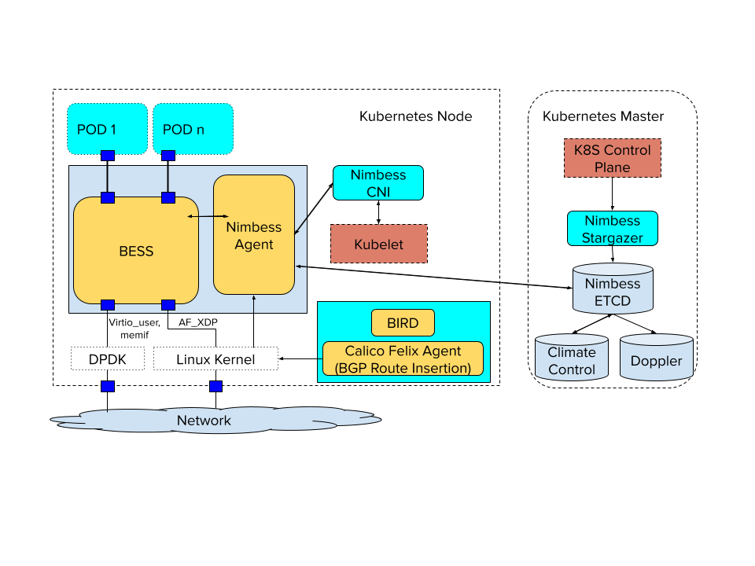

# Nimbess Controller Architecture

## Overview

Nimbess is a light-weight, micro-service controller architecture that is
completely distributed and can be run in any cloud environment. Nimbess by
default supports the Berkley Extensible Software Switch 
[BESS](https://github.com/NetSys/bess) data plane in order to achieve maximum 
network pipeline programmability and performance. The primary goal of Nimbess
is to change the approach to the networking paradigm in Kubernetes itself by
implementing Unified Network Policy across Kubernetes. More on how this works
can be found in the [Functional Design Guide](functional-spec.md). The purpose
of this document is to describe the software architecture and design.

## Background

Typical CNI or networking plugin designs for Kubernetes either rely on an SDN
controller/data plane combination and/or multiple external applications such
as iptables, haproxy/envoy, conntrack, etc in order to achieve a fully featured
network data plane within Kubernetes. These features include Service, Ingress,
and also "Network Policy". The Network Policy resource in Kubernetes is limited
and refers only to access-control policy of "who can talk to who". Furthermore,
other mechanisms like using Kubernetes Namespaces for multi-tenancy, or other
solutions like Network Service Mesh
([NSM](https://github.com/networkservicemesh)) are used to achieve CNF service
chaining. [Multus](https://github.com/intel/multus-cni) may also be leveraged
to provide additional interfaces to the pod by chaining multiple CNI calls.
These efforts end up fragmenting an overall bigger picture of what a cohesive
networking solution should look like in Kubernetes, because advanced networking
features for CNFs were outside of the original scope of Kubernetes.

One of the main goals of Nimbess is to offer a new way of solving advanced
Kubernetes networking use cases by using a single point of entry with a custom
resource definition (CRD) called Unified Network Policy (UNP). The UNP not
only provides advanced features within a single CRD, but also allows the user
to express network intent. For example, a user may request a policy where any
pod with label “x” should be able to talk to label “y”, but no one else at a
minimum required bandwidth of 25 Gbps. The policy would be translated on the
backend in order to recognize that a high speed path is required, and
reconfigure QoS and ACL in order to apply the requested intent across the
cluster’s network. UNP is not only limited to  access-control lists (ACL),
but also network slicing by including multi-tenancy, bandwidth requirements,
traffic differentiation (QoS), Service Function Chaining (SFC), etc. A single
policy may be applied to many pods, but a pod may only have a single UNP
applied to it at a time.

Additionally, CNI implementations are also inherently limited in Kubernetes,
due to the nature of the specification which limits CNI invocation to pod create
or delete calls. Efforts have been made to work around this issue using Network
Service Mesh ([NSM](https://github.com/networkservicemesh)), which allows for
dynamic update of ports and network fabric throughout the pod lifecycle.
Furthermore, the CNI spec only allows by default for a single port to be
created. Efforts like the [Multus](https://github.com/intel/multus-cni)
project have been implemented to work around this issue by allowing multiple
CNIs, and thus multiple ports to be created.

Nimbess resolves both of these issues in different ways. While there is a need
for high speed interfaces with CNFs, there is also a need to supply a kernel
interface for default Kubernetes networking and CNF management. With Nimbess,
a single kernel port for default network connectivity is provided, while also
providing a high-speed secondary interface. Nimbess then relies on a UNP in
order to determine how this pod should interact with the network and then
configures the secondary interface appropriately. This key point means that
rather than defining network configuration within pod annotations at pod
instantiation or deletion, pod's networking configuration is done separately as
a UNP resource declaration. This means that the pod's network configuration is
updatable at runtime by simply updating the policy. This different from NSM
for three reasons:

1. Nimbess only ever uses a single high-speed port for a pod
2. UNP does not try to do VNF/CNF orchestration with K8S
3. UNP is not restricted to L2-L3 service connectivity/policy

In container networking, there is no real reason to use more than one port to a
container. Technically speaking, a port just points to a socket referencing
virtual or physical memory address space. It does not matter if there is 1 or
more ports between a data plane and a container. Functionally, it matters for
traffic differentiation between a pod control plane, and perhaps one or more
data plane networks it is connected to. However, the goal of Nimbess is to 
simplify networking, and one way to do that is to do real traffic
differentiation within the data plane itself. Therefore with UNP, one can set
policy which ensures that bandwidth is reserved for a containers control or
management plane, while also applying QoS for dataplane connectivity and
slicing traffic correctly for multi-tenancy.

UNP can implement a Service Function Chain of CNFs, but it does not manage
CNFs or define them. UNP is restricted to what it does best, networking, and
therefore does not dictate CNF definitions or try to orchestrate them. The
process to create a chain would be for an operator to create the CNFs as
regular pods within Kubernetes, and then declare a UNP that defines a service
chain for those pods. Remember, the chain may be updated at anytime and include
new or different SFC classification or CNFs, a key advantage of Nimbess.

UNP is able to classify traffic from L2-L7. The goal of UNP is to offer service
policy mesh as used with other applications like [Istio](https://istio.io)
without the need for an Envoy sidecar proxy application. The goal is to
consolidate this type of functionality in the high speed dataplane, which will
give better performance and a single fabric for all network data traffic.

## Networking in Nimbess

Most CNIs today offer L3 CNI solutions where some form of routing is used to
control traffic between pods, especially across nodes. Some of these CNIs use
static routing, their own routing implementation, or well known routing
protocols such as BGP, which offers high scalability, fast route convergence
times, as well as features like Equal-Cost Multipath (ECMP), Anycast, and
VPN support. Therefore for L3 networking, Nimbess leverages iBGP as the control
plane protocol for routing traffic between pods. Alternatively, Nimbess also 
supports full L2 fabric across the cluster. This is important as many CNFs
are L2 and may require a full L2 fabric to function correctly.

## Architecture

Nimbess consists of several components ran as containers across Kubernetes:

### Nimbess ETCD
The distributed data store used by Nimbess in order to maintain k8s resources,
as well as per data plane and network fabric configuration.

### Nimbess Stargazer
Stargazer is responsible for watching k8s resources and reflecting them into
the Nimbess etcd. Stargazer also handles delegating work to Nimbess Agents if
further processing is required for those resources.

### Nimbess Agent
Nimbess Agent acts as the distributed controller across the k8s deployment. The
Agent is responsible for translating k8s resources into network resources.
While any Agent is capable of performing this function, the actual work of
rendering network resources into data plane configuration, as well as
configuring the data plane is only performed by the data plane's local Agent.
Each Agent has a full view of the network and all other Agents. The Agent is
also responsible for watching BGP routes injected in the kernel and configuring
the data plane appropriately.

### Nimbess CNI
Invoked by Kubelet and communicates with Nimbess Agent in order to handle CNI
calls.

### Calico BIRD/Felix Agent
Calico is used to provide the BGP stack and route insertion into the kernel.

### Climate Control
Climate Control serves as the CLI tool for interacting directly with Nimbess in
order to examine data plane state and Nimbess specific configuration.

### Doppler
Doppler provides a customized GUI in order to visually examine the k8s cluster
network, as well as visualize the data plane network fabric.
